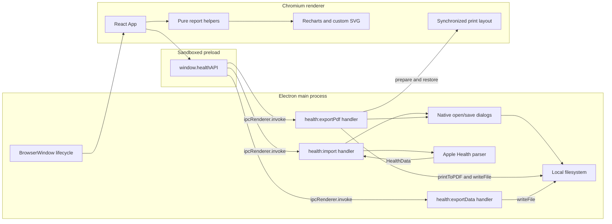
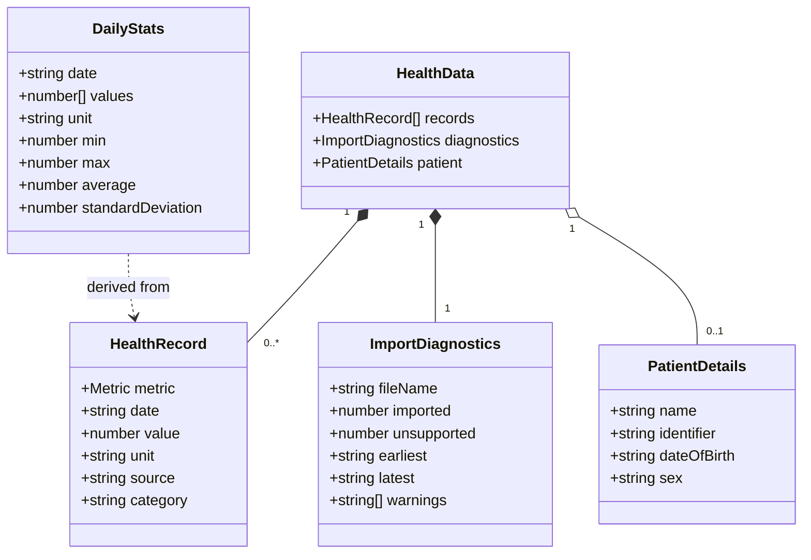
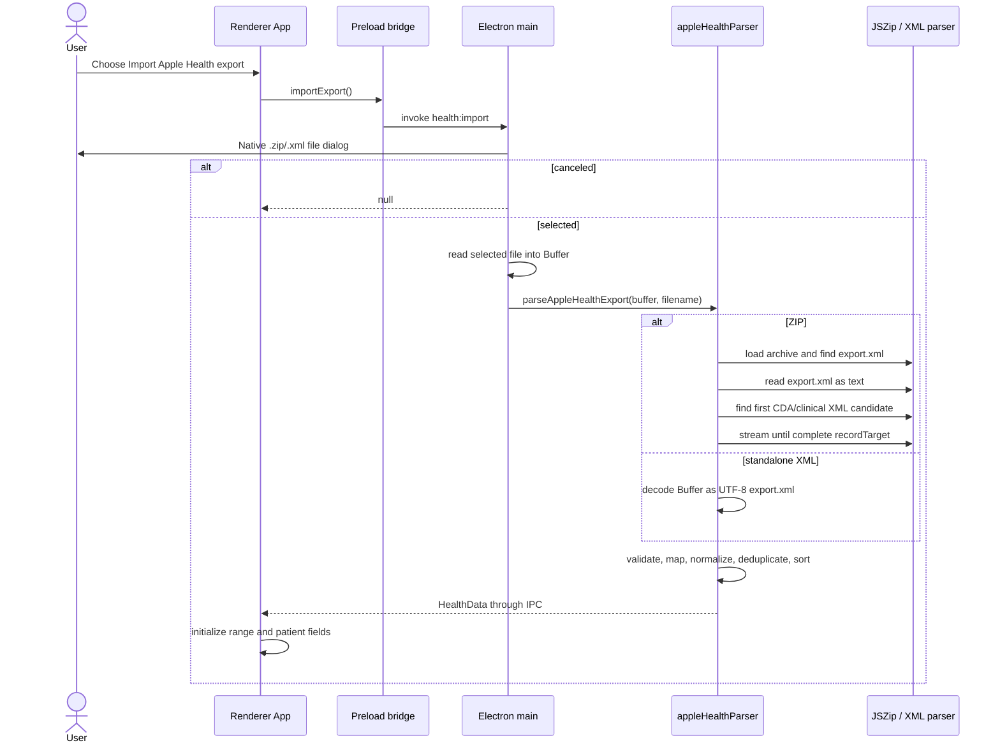
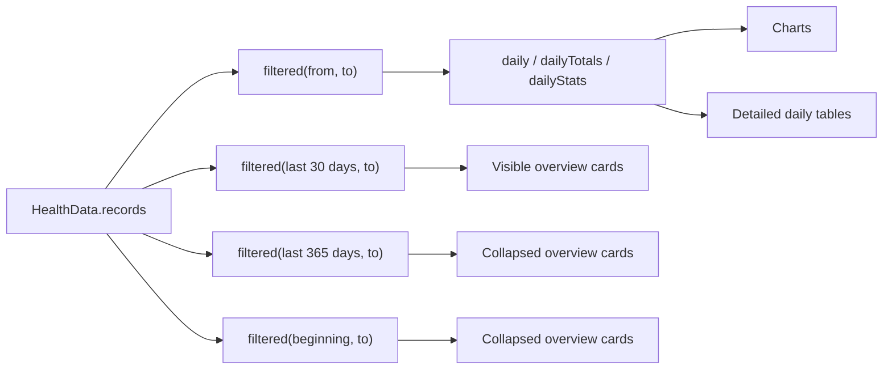
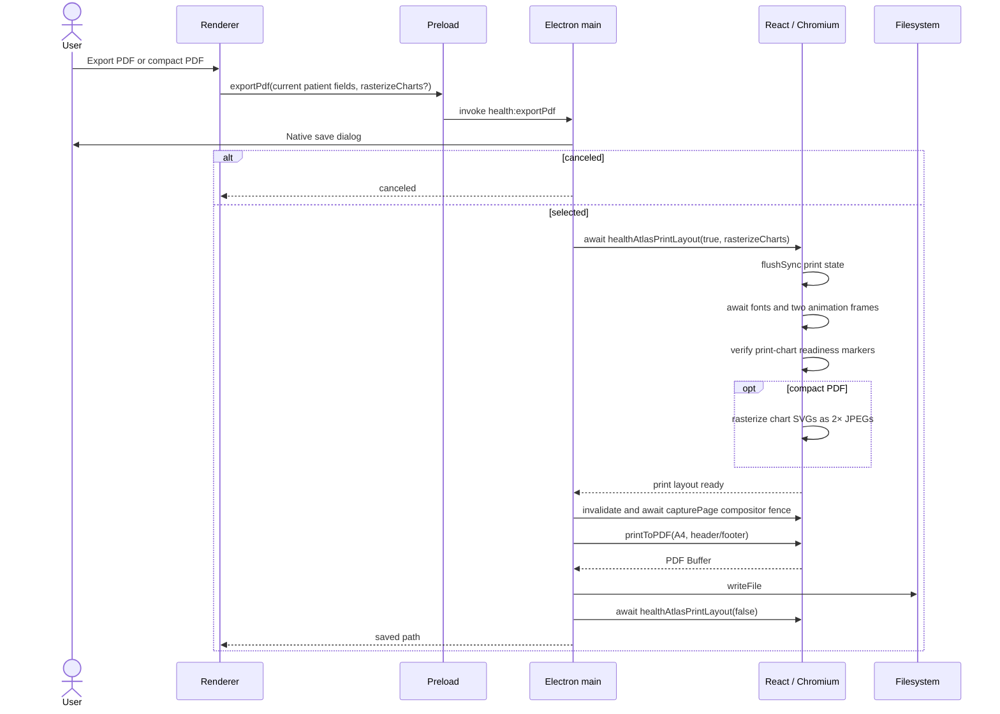

# AHDReport architecture

## 1. System purpose

AHDReport is a local-first Electron desktop application for viewing Apple Health data
and producing a clinical-style A4 PDF. It accepts a standalone `export.xml` or an
Apple Health ZIP containing `export.xml`. When a ZIP also contains a CDA/clinical XML
file, AHDReport extracts available patient demographics from its `recordTarget`.

The application has no server component, database, account system, or network API.
Imported records and user edits live only in the current renderer session. The main
process performs file access and PDF creation; the renderer performs filtering,
aggregation, visualization, and report composition.

## 2. Runtime architecture



The renderer is configured with `contextIsolation: true`, `nodeIntegration: false`,
and `sandbox: true`. It cannot use Node.js or the filesystem directly. The preload
script exposes two operations through `window.healthAPI`:

- `importExport()` opens a native file chooser and returns `HealthData | null`.
- `exportPdf(patientName, personnummer, dateOfBirth, sex, rasterizeCharts?)` opens a
  save dialog and returns `{ canceled, path? }`. The optional flag selects compact
  raster-chart PDF output.
- `exportData(format, content)` opens a save dialog and writes renderer-generated CSV
  or XLSX content, returning `{ canceled, path? }`.

The IPC surface does not accept arbitrary input or output paths; the main process owns
both native dialogs.

## 3. Module map

| Runtime/layer | File | Responsibility |
|---|---|---|
| Electron main | `electron/main.ts` | Window lifecycle, native dialogs, import/PDF/data-export IPC handlers, patient PDF header, synchronized PDF capture, filesystem writes |
| Electron main | `electron/appleHealthParser.ts` | ZIP discovery, HealthKit XML parsing, CDA patient extraction, metric mapping, validation, deduplication, diagnostics |
| Electron main | `electron/patientDefaults.ts` | Runtime patient defaults files, environment mapping, source precedence, and CDA/default merging |
| Preload | `electron/preload.cts` | Narrow `contextBridge` adapter between renderer calls and IPC channels |
| Shared contract | `src/shared/types.ts` | Metrics and IPC data types compiled for both Electron and renderer targets |
| Renderer entry | `src/main.tsx` | React root and stylesheet loading |
| Renderer | `src/App.tsx` | Session state, patient editor, overview cards, charts, detailed tables, CSV/XLSX serialization, and print-layout readiness protocol |
| Renderer model | `src/report.ts` | Pure filtering, formatting, daily aggregation, medians, deltas, and metric metadata |
| Styling | `src/styles.css` | Application, responsive, card, chart, and print presentation |
| Styling | `src/table-overrides.css` | Detailed-report table width overrides |
| Tests | `tests/appleHealthParser.test.ts` | Apple XML, ZIP, CDA, duplicate, sleep, and invalid-file behavior |
| Tests | `tests/report.test.ts` | Date filtering, daily statistics, medians, latest values, and deltas |

`src/shared/types.ts` is the boundary contract. The Electron build and renderer build
compile it independently; runtime values crossing IPC are plain serializable objects.

## 4. Core data model



`Metric` is a closed TypeScript string union. Supported values cover weight, heart
rate and resting heart rate, systolic and diastolic pressure, temperature, sleep,
activity, walking/mobility measurements, and medication records.

Optional properties are shown without optionality markers in the diagram. In the
source, `HealthData.patient`, the individual patient fields, `source`, `category`,
`earliest`, and `latest` can be absent.

Dates on `HealthRecord` are normalized to ISO timestamps and records are sorted in
ascending timestamp order before leaving the parser. `DailyStats` is a renderer-only
derived model and is never persisted or transferred over IPC.

## 5. Import pipeline



### 5.1 Health records

For a ZIP, the parser finds an entry whose path ends in `export.xml`. The main Apple
Health XML is currently read and parsed in full with `fast-xml-parser`. Each supported
HealthKit type maps to an internal `Metric`; unsupported types increment a diagnostic
counter. Invalid dates and non-numeric values are skipped.

Sleep records are converted from their start/end timestamps to duration in hours.
Exact duplicates are removed using metric, normalized timestamp, value, unit, and
source name. The parser returns imported count, unsupported count, earliest/latest
timestamps, and warnings such as missing medication data or unreadable clinical data.

### 5.2 CDA patient extraction

Clinical candidates match names containing `cda` or `clinical`, including common files
such as `export_cda.xml` and `clinical_data.xml`. Unlike `export.xml`, the clinical ZIP
entry is not decoded in full. `readClinicalPatient` consumes its node stream only until
the closing `recordTarget` tag is available, destroys the stream, and parses a small
synthetic `ClinicalDocument` containing that fragment.

Namespace prefixes are removed for CDA parsing. The extractor supports inline names
and structured prefix/given/family names, birth time, administrative sex, and
`patientRole/id` extensions. A Swedish-style 12-digit identifier is preferred when
multiple identifiers exist; otherwise the first extension is used.

This optimization limits CDA work, but it does not make the full import streaming:
the selected file is still read into a `Buffer`, JSZip loads the archive, and
`export.xml` is still materialized and parsed in memory.

## 6. Patient-data precedence and editing

Patient defaults are loaded by the Electron main process during every import. Sources
are merged from lowest to highest priority:

```text
working-directory .env
  → Electron user-data patient.env
  → file selected by AHDREPORT_PATIENT_ENV_FILE
  → process environment
```

The final non-empty runtime value for an individual field overrides its imported CDA
value. Supported variable names are:

- `AHDREPORT_PATIENT_NAME`
- `AHDREPORT_PERSONNUMMER`
- `AHDREPORT_DATE_OF_BIRTH`
- `AHDREPORT_SEX`

`VITE_DEFAULT_*` equivalents remain supported by the main-process parser only as a
legacy migration fallback. `App.tsx` contains no `import.meta.env` patient lookups, so
neither current nor legacy values are substituted into the renderer bundle by Vite.

The result is still not an encrypted secret: defaults are stored as plain text, sent to
the renderer as part of `HealthData.patient`, and held in memory while the editable
fields are visible. The design prevents build-time disclosure and allows values to be
changed without rebuilding. `.env` is ignored by Git and `.env.example` contains only
fictional values.

`PatientDetailsForm` owns draft input state locally. It writes changes into a ref held
by `App`, which avoids re-filtering hundreds of thousands of health records on every
keystroke. The same current ref values are passed to the PDF IPC call. Viewer mode
shows editable controls; print CSS hides the controls and shows a text-only definition
list containing name, personnummer, date of birth, and sex.

## 7. Renderer state and data flow

`App` deliberately uses React state and memoization rather than a global state library:

- `data` holds the imported `HealthData` for the current session.
- `from` and `to` define the inclusive selected report period.
- date inputs keep local drafts and debounce updates by 300 ms.
- `notice` contains import/export feedback.
- `printLayout` selects the dedicated PDF-safe chart tree.
- `patientProfile` is a ref so editing demographics does not rerender the report.



Quick ranges are 7 days, 30 days, 90 days, last 365 days, year-to-date, and all time.
The primary overview uses the 30 days ending at `to`; last-year and all-time summaries
are present in collapsed `<details>` sections.

The four overview metrics are weight, heart rate, steps, and sleep. Weight shows the
latest reading plus first-to-last delta. The others show medians and ranges. Heart-rate
"sustained" bounds use Tukey fences (1.5 × IQR) so isolated spikes do not define the
displayed minimum and maximum.

## 8. Visualization and detailed report composition

Dashboard groups are Vitals, Sleep & activity, and Mobility. Most standard metric
trends use Recharts area charts. Blood pressure uses a composed chart with systolic and
diastolic daily ranges plus an average tick; the UI does not describe these series as
"upper" or "lower". Heart rate, walking speed, step length, walking asymmetry, and
double support use the same daily min–max range bars with an average tick. These range
charts also include a dashed overall-average reference line and a legend explaining the
daily range, tick, and benchmark.

The detailed section is part of the same React document and is available in both viewer
and PDF modes. It contains specialized tables:

- `VitalsReportTable` combines pressure, heart rate, and weight.
- `ActivityReportTable` shows per-day totals as in-cell bars.
- `WalkingReportTable` combines mobility metrics.
- `ReportTable` handles remaining supported metrics.

`DailyDistribution` is a custom SVG showing daily min/max, average, standard deviation,
and shared column bounds. `DayTrace` shows intra-day shape. Distribution bounds also use
Tukey fences to prevent a rare bad reading from flattening every other row. Viewer
tables are limited to the 365 most recent days; PDF tables use the 90 most recent days
to reduce PDF size. Each report section emits explicit truncation or coverage notes when
the selected period and available data differ.

## 9. Export protocols

### 9.1 Data export

The split export control keeps **Export PDF** as its primary action and uses a native
`<details>` disclosure menu for compact PDF, CSV, and Excel options. The disclosure is
not React state, so opening it does not rerender the potentially large dashboard and
detailed tables.

CSV and XLSX exports contain records in the selected report period, newest first, with
date, display metric name, value, unit, source, and category columns. CSV includes a
UTF-8 BOM for spreadsheet compatibility and quotes spreadsheet-sensitive values. XLSX
is assembled in the renderer as a minimal Open XML workbook with JSZip, which is loaded
only when Excel export is requested. The content is passed through the narrow preload
bridge; the main process still owns the destination chooser and write.

### 9.2 PDF export protocol

PDF export requires a separate layout pass because a chart measured in the 1440px
viewer cannot be safely scaled into an A4 card. The renderer therefore exposes an
internal `window.healthAtlasPrintLayout(active, rasterizeCharts?)` promise for the main
process to call.
This is not part of the preload API and is only used by AHDReport's own main process.



In print layout:

- the report root is fixed to 718px, matching the intended A4 content geometry;
- chart grids become one column;
- Recharts `ResponsiveContainer` is replaced by explicit 680 × 260 chart canvases;
- every fixed chart emits a `data-pdf-chart-ready` marker;
- actions, date inputs, notices, chart coverage notes, and the pressure legend are hidden;
- the selected From/To range and patient details are rendered as plain text;
- the main process adds a patient summary header, printed date, and page numbering.

The standard PDF preserves chart vectors. Compact PDF mode serializes each ready chart
SVG, draws it to a white 2× canvas, waits for the JPEG (quality 0.88) to decode, and
replaces the SVG in the print DOM before capture. This trades vector scalability for
smaller chart payloads while retaining print-quality chart resolution.

The renderer uses `flushSync`, font readiness, animation frames, and structural chart
checks before resolving the preparation promise. The main process then waits for a
Chromium compositor frame before `printToPDF`. A `finally` block restores viewer layout
and the original window background even if PDF creation or writing fails.

## 10. Build and development

| Concern | Implementation |
|---|---|
| Renderer development | Vite dev server on `127.0.0.1:5173` |
| Renderer production build | `vite build` to `dist/`; relative `base: './'` supports `file://` loading |
| Electron build | `tsc -p tsconfig.electron.json` to `dist-electron/` using NodeNext modules |
| Development orchestration | `concurrently`, `wait-on`, and `VITE_DEV_SERVER_URL` |
| Testing | Vitest tests pure parser and report functions without launching Electron |
| CI | `.github/workflows/ci.yml` installs dependencies, tests, and builds the project |

Commands:

```bash
npm run dev
npm test
npm run build
```

## 11. Security and privacy properties

- The renderer is sandboxed and receives only serialized health data through the
  preload bridge.
- Native dialogs, local reads, and PDF writes remain in the main process.
- CDA/XML text is rendered as React data, not injected as HTML. Patient text used in
  Electron's PDF header template is HTML-escaped.
- The repository contains no application network client or telemetry path.
- Session data is not persisted by AHDReport and is discarded when the session is
  cleared or the application closes.
- `.env` and common Apple Health export paths are ignored by Git to reduce accidental
  disclosure. Runtime patient defaults are loaded only by the main process and are not
  compiled into renderer assets, but their plain-text files still require protection.

The parser still processes untrusted local files in the privileged main process and
materializes the primary HealthKit XML in memory. File-size limits, streaming
`export.xml` parsing, and deeper XML resource controls would be appropriate future
hardening for very large or adversarial inputs.

## 12. Current constraints and non-goals

- One window and one in-memory session; there is no history or persistence layer.
- Apple Health XML/ZIP is the only import format.
- Patient demographics are editable, but health measurements are read-only.
- Medication is reported only when supported records exist; there is no manual
  medication entry workflow.
- Detailed viewer tables are capped at 365 days per section; PDF tables are capped at
  90 days per section to bound report size.
- The renderer is intentionally concentrated in `App.tsx`; splitting it into feature
  modules may become useful as the UI and automated component-test surface grow.
