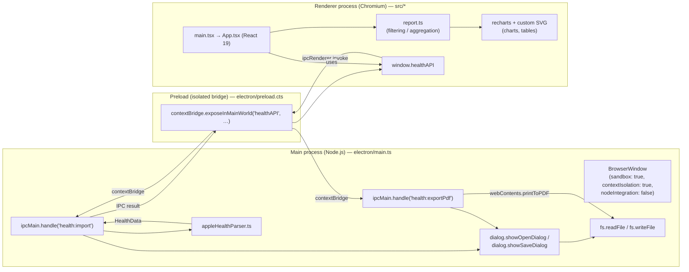
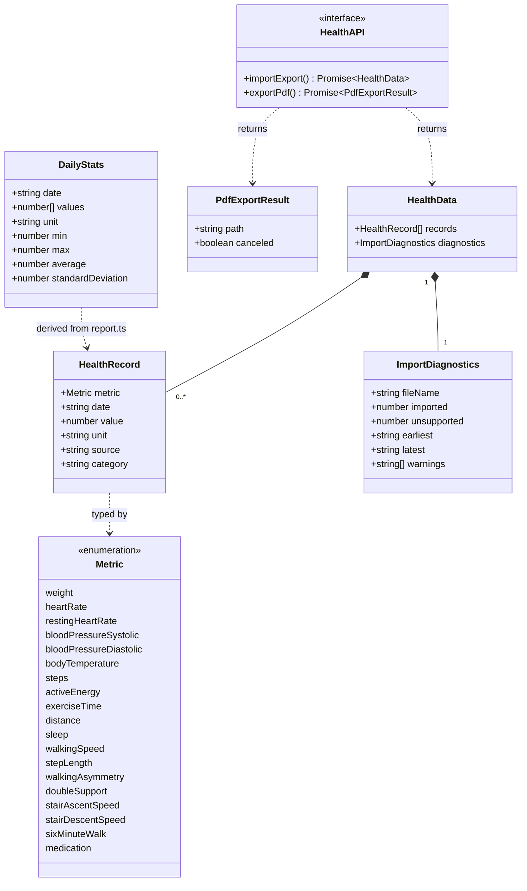
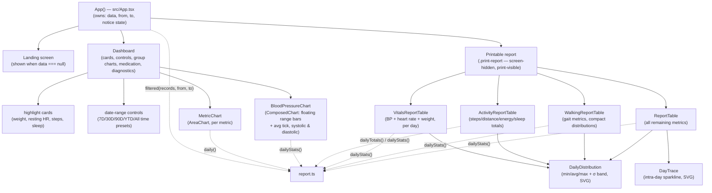
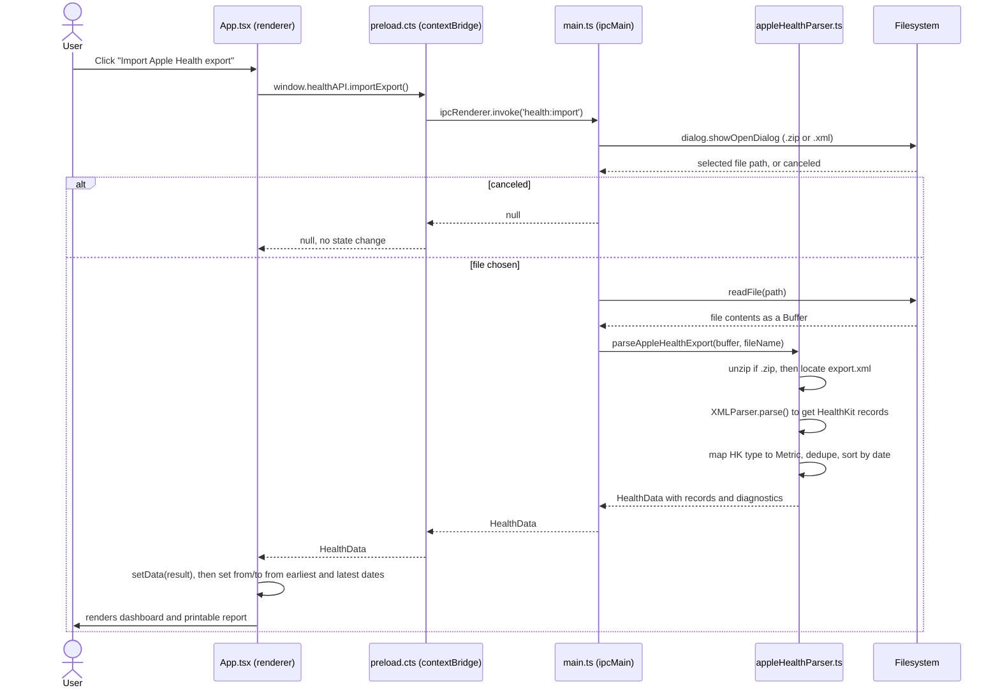
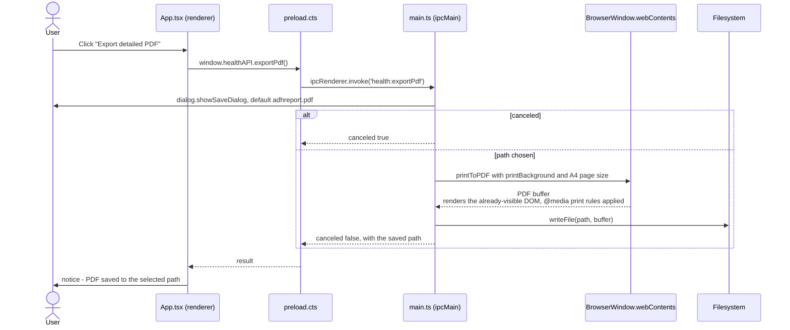
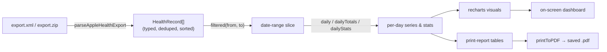

# ADHReport — Architecture & Design Specification

## 1. Purpose

ADHReport is a local-first Electron desktop application that imports an Apple Health
export (`export.xml` or the zipped `export.zip`), lets a user browse and filter their
health metrics over a date range, and produces a printable / PDF clinical-style report.
No data leaves the machine: import, parsing, aggregation, rendering, and PDF generation
all happen locally.

## 2. Process Architecture

The app follows Electron's standard three-context split. The renderer has **no** direct
Node.js or filesystem access; all privileged work (file dialogs, filesystem reads, PDF
capture) happens in the main process and is exposed to the renderer through a narrow,
typed `contextBridge` API.

**Why this shape:** `nodeIntegration: false` + `contextIsolation: true` + `sandbox: true`
(`electron/main.ts:10`) mean the renderer (which loads a normal web page / React app) can
never reach `fs`, `child_process`, or other Node APIs directly, even if it were later
compromised (e.g. via a malicious SVG/XML payload). The only surface it has is the two
functions the preload script explicitly whitelists.

## 3. Module Map

| Layer | File | Responsibility |
|---|---|---|
| Main | `electron/main.ts` | App lifecycle, `BrowserWindow` creation, IPC handlers for import & PDF export |
| Main | `electron/appleHealthParser.ts` | Unzips/reads the export, parses HealthKit XML into typed, deduplicated `HealthRecord[]` |
| Bridge | `electron/preload.cts` | Exposes `window.healthAPI` (`importExport`, `exportPdf`) via `contextBridge` |
| Shared | `src/shared/types.ts` | Types shared by main and renderer: `Metric`, `HealthRecord`, `HealthData`, `HealthAPI` |
| Renderer entry | `src/main.tsx` | Mounts the React tree, loads global stylesheets |
| Renderer | `src/App.tsx` | All UI: landing/import screen, dashboard, charts, printable report tables |
| Renderer | `src/report.ts` | Pure functions: date filtering, daily average/total/statistics aggregation, formatting |
| Styling | `src/styles.css`, `src/table-overrides.css` | Screen + print stylesheets |
| Tests | `tests/*.test.ts` | Vitest unit tests for the parser and the report/aggregation functions |

Only `src/shared/types.ts` is imported by *both* the Node-side (`electron/`) and the
browser-side (`src/`) code — it is the contract between the two worlds and is compiled
twice: once by `tsconfig.json` (renderer, DOM libs) and once by `tsconfig.electron.json`
(Node target).

## 4. Domain Model (Class Diagram)

Notes on the model above:

- `Metric` is modeled as an `<<enumeration>>` even though in TypeScript it's a string
  union (`src/shared/types.ts:1`), which is the closest UML equivalent for a closed set
  of literal values.
- `source`, `category`, `earliest`, and `latest` are all optional (`?`) in the TypeScript
  source; UML attributes don't have a first-class optional marker, so treat every field
  above as potentially absent unless the accompanying prose says otherwise.
- `HealthAPI.importExport()` actually resolves to `Promise<HealthData | null>` — `null`
  when the user cancels the file-picker dialog. `PdfExportResult` mirrors the anonymous
  `{ path?: string; canceled: boolean }` return type of `exportPdf()` (`src/shared/types.ts:6`);
  it isn't a named type in the code, only introduced here for diagram clarity.
- `DailyStats` (`src/report.ts:13`) is not persisted or transferred over IPC — it is a
  derived, renderer-only aggregate computed on demand from the currently-filtered
  `HealthRecord[]` for a single metric.

## 5. Component Diagram — Renderer UI

`App.tsx` is intentionally a flat, single-file component tree (no routing, no global
state library) — the only piece of state is `{ data, from, to, notice }`, and every chart
or table is a pure function of `records` (the already date-filtered slice) plus the
`report.ts` aggregation helpers. There is one DOM tree containing both the interactive
dashboard and the `.print-report` section; CSS `@media print` rules toggle which parts
are visible, so printing/PDF export needs no separate render pass.

## 6. Sequence — Import an Apple Health export

## 7. Sequence — Export to PDF

Because `printToPDF` captures the **already-rendered** page, there is no second
render/navigation step — the same `.print-report` DOM that is hidden on screen (via
`@media print` CSS) is what gets captured, so the PDF and the interactive dashboard are
always in sync with the currently selected date range.

## 8. Data Flow Summary

## 9. Build & Tooling

| Concern | Tool | Notes |
|---|---|---|
| Renderer bundling | Vite 6 (`vite.config.ts`) | `base: './'` so `dist/index.html` loads with relative asset paths under `file://` in packaged builds |
| Renderer types | `tsconfig.json` | `strict`, DOM libs, `noEmit` (Vite handles transpilation) |
| Electron/Node compile | `tsconfig.electron.json` + `tsc` | Compiles `electron/` + `src/shared/` to `dist-electron/`, `NodeNext` module resolution |
| Dev loop | `concurrently` + `wait-on` | `npm run dev` starts Vite on `127.0.0.1:5173`, waits for it, then launches Electron pointed at `VITE_DEV_SERVER_URL` |
| Packaging input | `dist/` (renderer) + `dist-electron/` (main/preload) | `main.ts` loads `dist/index.html` directly when `VITE_DEV_SERVER_URL` is unset |
| Tests | Vitest | `tests/report.test.ts` (aggregation/filtering), `tests/appleHealthParser.test.ts` (XML/zip parsing) — both exercise pure functions with no Electron runtime needed |

## 10. Security Model

- **Renderer sandboxing**: `contextIsolation: true`, `sandbox: true`, `nodeIntegration: false`
  (`electron/main.ts:10`) — the imported XML/zip is parsed entirely in the main process;
  the renderer only ever sees the resulting plain-data `HealthData` object.
- **Minimal IPC surface**: exactly two channels (`health:import`, `health:exportPdf`),
  both parameterless from the renderer's side — the renderer cannot pass an arbitrary
  file path into the main process; the main process always drives the native file dialog.
- **No network egress**: there is no HTTP client anywhere in the codebase; all
  computation and rendering happens on-device, matching the "nothing is uploaded"
  claim shown on the landing screen.

## 11. Known Constraints / Non-Goals

- Single-window, single-session app — no persistence between launches (closing the app
  discards the imported data; the user re-imports each session).
- No manual data entry — medication and all other metrics are read-only reflections of
  the Apple Health export; `App.tsx` explicitly disables manual medication entry.
- Report tables cap at `MAX_TABLE_ROWS` (365) most recent days per section, to keep the
  printed/PDF report a bounded size. When a table or metric column has more data than
  that, or when a specific metric's own data starts later or ends earlier than the
  selected report period, `App.tsx` renders an explicit note (`coverageNote` /
  `truncationNote`) under that table or chart rather than silently truncating.
- Single supported source format: Apple Health's HealthKit XML export (`export.xml`,
  optionally zipped as `export.zip`); no support for other wearable/health export formats.
